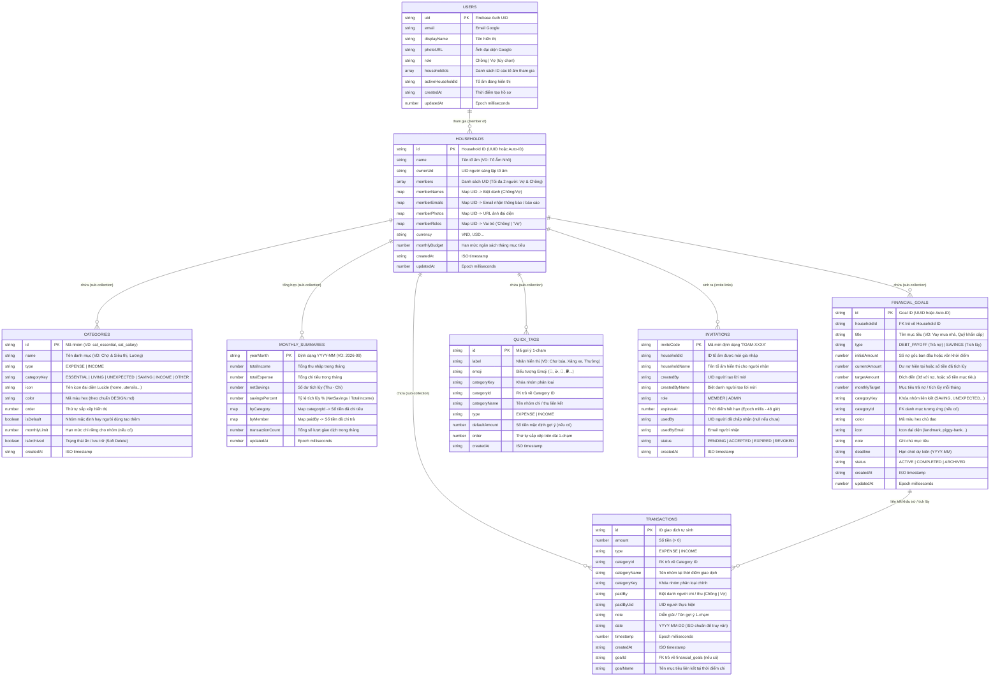

# THIẾT KẾ CƠ SỞ DỮ LIỆU ĐA GIA ĐÌNH (MULTI-TENANT FIRESTORE DATA MODEL)
### Dự Án: "Tổ Ấm Nhỏ" — Family Expense Management

Tài liệu này định nghĩa chi tiết kiến trúc cơ sở dữ liệu **NoSQL Cloud Firestore** chuẩn **Multi-Tenant (Đa hộ gia đình)**, hỗ trợ tùy biến danh mục linh hoạt, mục tiêu tự do tài chính (quản lý nợ & tích lũy), gợi ý 1-chạm (Quick Tags), phân quyền tài khoản Google, cơ chế tạo mã mời thành viên bảo mật (tối đa 2 người: Vợ & Chồng), cập nhật giao dịch nguyên tử (Atomic Transactions) và bộ quy tắc bảo mật phân lớp tuyệt đối.

---

## 1. 🗺️ Sơ Đồ Cấu Trúc Thực Thể (ERD Diagram)



---

## 2. 🗂️ Chi Tiết Các Collections & Documents

### 2.1. Root Collection: `users/{userId}`
Lưu trữ thông tin định danh người dùng sau khi xác thực qua Firebase Authentication (Google OAuth).
- **Đường dẫn Document:** `users/{userId}` (với `{userId}` chính là `request.auth.uid`).
- **Mẫu dữ liệu JSON thực tế:**
```json
{
  "uid": "google_uid_chong_123",
  "email": "chong.nguyen@gmail.com",
  "displayName": "Nguyễn Văn Chồng",
  "photoURL": "https://lh3.googleusercontent.com/a/...",
  "role": "Chồng",
  "householdIds": ["household_to_am_nho_01"],
  "activeHouseholdId": "household_to_am_nho_01",
  "createdAt": "2026-09-04T08:00:00Z",
  "updatedAt": 1788480000000
}
```

---

### 2.2. Root Collection: `households/{householdId}`
Đại diện cho không gian tài chính độc lập của một gia đình (**Tenant**). Hỗ trợ tối đa 2 thành viên đồng hành (Vợ & Chồng).
- **Đường dẫn Document:** `households/{householdId}`
- **Mẫu dữ liệu JSON thực tế:**
```json
{
  "id": "household_to_am_nho_01",
  "name": "Tổ Ấm Nhỏ",
  "ownerUid": "google_uid_chong_123",
  "members": [
    "google_uid_chong_123",
    "google_uid_vo_456"
  ],
  "memberNames": {
    "google_uid_chong_123": "Chồng",
    "google_uid_vo_456": "Vợ"
  },
  "memberEmails": {
    "google_uid_chong_123": "chong.nguyen@gmail.com",
    "google_uid_vo_456": "vo.le@gmail.com"
  },
  "memberPhotos": {
    "google_uid_chong_123": "https://lh3.googleusercontent.com/a/...",
    "google_uid_vo_456": "https://lh3.googleusercontent.com/a/..."
  },
  "memberRoles": {
    "google_uid_chong_123": "Chồng",
    "google_uid_vo_456": "Vợ"
  },
  "currency": "VND",
  "monthlyBudget": 30000000,
  "createdAt": "2026-09-01T00:00:00Z",
  "updatedAt": 1788480000000
}
```

---

### 2.3. Sub-collection: `households/{householdId}/categories/{categoryId}`
Quản lý các danh mục Thu nhập & Chi tiêu riêng của gia đình. Hỗ trợ cơ chế ẩn/lưu trữ (**Soft Delete** `isArchived: true`), xóa vĩnh viễn (**Hard Delete**) khi chưa có giao dịch, và tự động bổ sung danh mục mặc định (**Self-healing** `seedMissingCategories`).

- **Mẫu dữ liệu JSON (Chi tiêu):**
```json
{
  "id": "cat_essential",
  "name": "Tổ ấm & Con cái",
  "type": "EXPENSE",
  "categoryKey": "ESSENTIAL",
  "icon": "home",
  "color": "#0F3D39",
  "order": 1,
  "isDefault": true,
  "monthlyLimit": 20000000,
  "isArchived": false,
  "createdAt": "2026-09-01T00:00:00Z"
}
```

- **Mẫu dữ liệu JSON (Thu nhập):**
```json
{
  "id": "cat_salary",
  "name": "Lương & Thưởng",
  "type": "INCOME",
  "categoryKey": "INCOME",
  "icon": "banknote",
  "color": "#10B981",
  "order": 1,
  "isDefault": true,
  "isArchived": false,
  "createdAt": "2026-09-01T00:00:00Z"
}
```

> [!TIP]
> **Các Danh Mục Mặc Định Khi Khởi Tạo Tổ Ấm:**
> - **Chi tiêu (EXPENSE):**
>   1. `cat_essential`: "Tổ ấm & Con cái" (`#0F3D39` - Pine Emerald, icon `home`)
>   2. `cat_living`: "Sinh hoạt & Hẹn hò" (`#4A6B68` - Muted Sage, icon `coffee`)
>   3. `cat_unexpected`: "Sức khỏe & Đột xuất" (`#B45309` - Warm Amber, icon `heart-pulse`)
>   4. `cat_saving`: "Tích lũy & Tương lai" (`#10B981` - Emerald Green, icon `piggy-bank`)
> - **Thu nhập (INCOME):**
>   1. `cat_salary`: "Lương & Thưởng" (`#10B981` - Emerald Green, icon `banknote`)
>   2. `cat_extra_income`: "Làm thêm & Kinh doanh" (`#4A6B68` - Muted Sage, icon `briefcase`)
>   3. `cat_investment_income`: "Đầu tư & Tiết kiệm" (`#0F3D39` - Pine Emerald, icon `coins`)
>   4. `cat_gift_income`: "Hiếu hỉ & Quà tặng" (`#B45309` - Warm Amber, icon `gift`)

---

### 2.4. Sub-collection: `households/{householdId}/transactions/{transactionId}`
Chi tiết từng khoản chi tiêu hoặc thu nhập hàng ngày, có thể liên kết trực tiếp tới mục tiêu tài chính (`goalId`).

- **Mẫu dữ liệu JSON:**
```json
{
  "id": "tx_20260904_001",
  "amount": 350000,
  "type": "EXPENSE",
  "categoryId": "cat_essential",
  "categoryName": "Tổ ấm & Con cái",
  "categoryKey": "ESSENTIAL",
  "paidBy": "Chồng",
  "paidByUid": "google_uid_chong_123",
  "note": "Chợ & Siêu thị",
  "date": "2026-09-04",
  "timestamp": 1788480000000,
  "goalId": "goal_nha_o_xa_hoi",
  "goalName": "Vay mua nhà xã hội",
  "createdAt": "2026-09-04T10:30:00Z"
}
```

---

### 2.5. Sub-collection: `households/{householdId}/monthly_summaries/{YYYY-MM}`
Document tổng hợp sẵn số liệu tháng theo kiến trúc **Aggregated Document Pattern**, giúp tối ưu chi phí đọc Firestore và hiển thị tức thì trên Dashboard.

- **Document ID:** `2026-09` (định dạng `YYYY-MM`)
- **Mẫu dữ liệu JSON:**
```json
{
  "yearMonth": "2026-09",
  "totalIncome": 63000000,
  "totalExpense": 33840000,
  "netSavings": 29160000,
  "savingsPercent": 46,
  "byCategory": {
    "cat_essential": 16850000,
    "cat_living": 340000,
    "cat_unexpected": 1650000,
    "cat_saving": 15000000
  },
  "byMember": {
    "Chồng": 27340000,
    "Vợ": 6500000
  },
  "transactionCount": 42,
  "updatedAt": 1788480000000
}
```

---

### 2.6. Sub-collection: `households/{householdId}/financial_goals/{goalId}`
Quản lý các mục tiêu tự do tài chính của gia đình, gồm 2 loại:
- `DEBT_PAYOFF`: Trả nợ (tiền nợ giảm dần về 0đ qua từng giao dịch).
- `SAVINGS`: Tích lũy (số tiền tăng dần cho đến khi chạm đích `targetAmount`).

- **Mẫu dữ liệu JSON (Khoản nợ trả góp):**
```json
{
  "id": "goal_nha_o_xa_hoi",
  "householdId": "household_to_am_nho_01",
  "title": "Vay ngân hàng mua nhà",
  "type": "DEBT_PAYOFF",
  "initialAmount": 1500000000,
  "currentAmount": 685000000,
  "targetAmount": 0,
  "monthlyTarget": 15000000,
  "categoryKey": "SAVING",
  "categoryId": "cat_saving",
  "color": "#B45309",
  "icon": "landmark",
  "note": "Gói vay ưu đãi 20 năm",
  "deadline": "2035-12",
  "status": "ACTIVE",
  "createdAt": "2026-09-01T08:00:00Z",
  "updatedAt": 1788480000000
}
```

- **Mẫu dữ liệu JSON (Quỹ tích lũy):**
```json
{
  "id": "goal_quy_khan_cap",
  "householdId": "household_to_am_nho_01",
  "title": "Quỹ khẩn cấp 6 tháng",
  "type": "SAVINGS",
  "initialAmount": 30000000,
  "currentAmount": 180000000,
  "targetAmount": 180000000,
  "monthlyTarget": 10000000,
  "categoryKey": "SAVING",
  "categoryId": "cat_saving",
  "color": "#10B981",
  "icon": "piggy-bank",
  "status": "COMPLETED",
  "createdAt": "2026-09-01T08:00:00Z",
  "updatedAt": 1788480000000
}
```

---

### 2.7. Sub-collection: `households/{householdId}/quick_tags/{tagId}`
Lưu trữ các phím tắt 1-chạm giúp ghi nhận giao dịch dưới 3 giây. Hỗ trợ cả Chi tiêu và Thu nhập.

- **Mẫu dữ liệu JSON:**
```json
{
  "id": "tag_cho_bua",
  "label": "Chợ & Siêu thị",
  "emoji": "🛒",
  "categoryKey": "ESSENTIAL",
  "categoryId": "cat_essential",
  "categoryName": "Tổ ấm & Con cái",
  "type": "EXPENSE",
  "defaultAmount": 200000,
  "order": 1,
  "createdAt": "2026-09-01T00:00:00Z"
}
```

---

### 2.8. Root Collection: `invitations/{inviteCode}`
Quản lý mã mời gia nhập tổ ấm định dạng `TOAM-XXXX` (hạn 48 giờ). Tự động chặn tạo mã mời nếu tổ ấm đã đủ 2 người (Vợ & Chồng).

- **Mẫu dữ liệu JSON:**
```json
{
  "inviteCode": "TOAM-8868",
  "householdId": "household_to_am_nho_01",
  "householdName": "Tổ Ấm Nhỏ",
  "createdBy": "google_uid_chong_123",
  "createdByName": "Chồng",
  "role": "MEMBER",
  "expiresAt": 1788652800000,
  "usedBy": null,
  "usedByEmail": null,
  "status": "PENDING",
  "createdAt": "2026-09-04T10:00:00Z"
}
```

---

## 3. ⚡ Các Thao Tác Nguyên Tử (Atomic Transactions)

Toàn bộ thao tác cập nhật số liệu đều sử dụng `runTransaction` của Cloud Firestore để đảm bảo tính toàn vẹn tuyệt đối (**ACID**).

### 3.1. Thêm Giao Dịch & Cập Nhật Tức Thì Tổng Hợp Tháng
```typescript
import { doc, runTransaction, increment, collection } from "firebase/firestore";
import { db } from "../services/firebase";

export async function addTransactionWithSummary(
  householdId: string,
  txData: Omit<Transaction, 'id' | 'createdAt' | 'timestamp'>
): Promise<string> {
  const yearMonth = txData.date.substring(0, 7); // "YYYY-MM"
  const summaryRef = doc(db, `households/${householdId}/monthly_summaries/${yearMonth}`);
  const newTxRef = doc(collection(db, `households/${householdId}/transactions`));

  await runTransaction(db, async (transaction) => {
    // 1. Lưu bản ghi giao dịch
    transaction.set(newTxRef, {
      ...txData,
      id: newTxRef.id,
      timestamp: Date.now(),
      createdAt: new Date().toISOString()
    });

    // 2. Cập nhật cộng dồn số liệu tháng nguyên tử
    const isExpense = txData.type === 'EXPENSE';
    const amount = txData.amount;

    transaction.set(summaryRef, {
      yearMonth,
      totalExpense: isExpense ? increment(amount) : increment(0),
      totalIncome: !isExpense ? increment(amount) : increment(0),
      [`byCategory.${txData.categoryId}`]: isExpense ? increment(amount) : increment(0),
      [`byMember.${txData.paidBy}`]: isExpense ? increment(amount) : increment(0),
      transactionCount: increment(1),
      updatedAt: Date.now()
    }, { merge: true });
  });

  return newTxRef.id;
}
```

### 3.2. Cập Nhật Giao Dịch Đa Chiều (Chuyển tháng, đổi nhóm, đổi người chi, gỡ mục tiêu)
```typescript
export async function updateTransactionWithSummary(
  householdId: string,
  oldTx: Transaction,
  updatedTx: Transaction
): Promise<void> {
  const oldYearMonth = oldTx.date.substring(0, 7);
  const newYearMonth = updatedTx.date.substring(0, 7);
  const txRef = doc(db, `households/${householdId}/transactions/${oldTx.id}`);

  const oldIsExpense = oldTx.type === 'EXPENSE';
  const newIsExpense = updatedTx.type === 'EXPENSE';

  await runTransaction(db, async (transaction) => {
    // 1. Cập nhật payload giao dịch, gỡ bỏ goalId nếu bị hủy liên kết
    const updatePayload: Record<string, any> = {
      ...updatedTx,
      updatedAt: Date.now()
    };
    if (oldTx.goalId && !updatedTx.goalId) {
      updatePayload.goalId = deleteField();
      updatePayload.goalName = deleteField();
    }
    transaction.set(txRef, updatePayload, { merge: true });

    // 2. Điều chỉnh số liệu tháng
    if (oldYearMonth === newYearMonth) {
      // Cùng tháng: bù trừ chênh lệch delta trực tiếp
      const summaryRef = doc(db, `households/${householdId}/monthly_summaries/${newYearMonth}`);
      const updates: Record<string, any> = { yearMonth: newYearMonth, updatedAt: Date.now() };

      const oldExp = oldIsExpense ? oldTx.amount : 0;
      const newExp = newIsExpense ? updatedTx.amount : 0;
      const expDelta = newExp - oldExp;
      if (expDelta !== 0) updates.totalExpense = increment(expDelta);

      const oldInc = !oldIsExpense ? oldTx.amount : 0;
      const newInc = !newIsExpense ? updatedTx.amount : 0;
      const incDelta = newInc - oldInc;
      if (incDelta !== 0) updates.totalIncome = increment(incDelta);

      // Cập nhật phân bổ danh mục & người chi...
      transaction.set(summaryRef, updates, { merge: true });
    } else {
      // Khác tháng: trừ khỏi tháng cũ và cộng dồn vào tháng mới
      const oldSummaryRef = doc(db, `households/${householdId}/monthly_summaries/${oldYearMonth}`);
      const newSummaryRef = doc(db, `households/${householdId}/monthly_summaries/${newYearMonth}`);

      // Giảm trừ tháng cũ
      transaction.set(oldSummaryRef, {
        totalExpense: oldIsExpense ? increment(-oldTx.amount) : increment(0),
        totalIncome: !oldIsExpense ? increment(-oldTx.amount) : increment(0),
        [`byCategory.${oldTx.categoryId}`]: oldIsExpense ? increment(-oldTx.amount) : increment(0),
        [`byMember.${oldTx.paidBy}`]: oldIsExpense ? increment(-oldTx.amount) : increment(0),
        transactionCount: increment(-1),
        updatedAt: Date.now()
      }, { merge: true });

      // Cộng vào tháng mới
      transaction.set(newSummaryRef, {
        totalExpense: newIsExpense ? increment(updatedTx.amount) : increment(0),
        totalIncome: !newIsExpense ? increment(updatedTx.amount) : increment(0),
        [`byCategory.${updatedTx.categoryId}`]: newIsExpense ? increment(updatedTx.amount) : increment(0),
        [`byMember.${updatedTx.paidBy}`]: newIsExpense ? increment(updatedTx.amount) : increment(0),
        transactionCount: increment(1),
        updatedAt: Date.now()
      }, { merge: true });
    }
  });
}
```

### 3.3. Cập Nhật Tiến Độ Mục Tiêu Tự Do Tài Chính
```typescript
export async function updateGoalProgress(
  householdId: string,
  goalId: string,
  amountDelta: number,
  type: 'DEBT_PAYOFF' | 'SAVINGS'
): Promise<void> {
  const goalRef = doc(db, `households/${householdId}/financial_goals`, goalId);

  await runTransaction(db, async (transaction) => {
    const snap = await transaction.get(goalRef);
    if (!snap.exists()) return;

    const data = snap.data() as FinancialGoal;
    let newAmount = data.currentAmount;
    let newStatus = data.status;

    if (type === 'DEBT_PAYOFF') {
      // Dư nợ giảm dần về 0đ
      newAmount = Math.max(0, data.currentAmount - amountDelta);
      newStatus = newAmount === 0 ? 'COMPLETED' : 'ACTIVE';
    } else {
      // Tích lũy tăng dần tới targetAmount
      newAmount = Math.max(0, data.currentAmount + amountDelta);
      newStatus = (data.targetAmount > 0 && newAmount >= data.targetAmount) ? 'COMPLETED' : 'ACTIVE';
    }

    transaction.update(goalRef, {
      currentAmount: newAmount,
      status: newStatus,
      updatedAt: Date.now()
    });
  });
}
```

### 3.4. Chấp Nhận Mã Mời Gia Nhập Tổ Ấm (Giới hạn tối đa 2 người)
```typescript
export async function acceptInvitation(
  inviteCode: string,
  user: UserProfile
): Promise<string> {
  const inviteRef = doc(db, 'invitations', inviteCode);

  return await runTransaction(db, async (transaction) => {
    const inviteSnap = await transaction.get(inviteRef);
    if (!inviteSnap.exists()) throw new Error('Mã mời không tồn tại hoặc đã bị xóa');

    const invite = inviteSnap.data() as Invitation;
    if (invite.status !== 'PENDING' || invite.expiresAt < Date.now()) {
      throw new Error('Mã mời đã hết hạn hoặc đã được sử dụng');
    }

    if (invite.createdBy === user.uid) {
      throw new Error('Đây là mã mời do chính bạn tạo ra.');
    }

    const householdRef = doc(db, 'households', invite.householdId);
    const userRef = doc(db, 'users', user.uid);

    // 1. Đổi trạng thái mã mời sang ACCEPTED
    transaction.update(inviteRef, {
      status: 'ACCEPTED',
      usedBy: user.uid,
      usedByEmail: user.email
    });

    // 2. Bổ sung người dùng vào thành viên tổ ấm
    transaction.update(householdRef, {
      members: arrayUnion(user.uid),
      [`memberNames.${user.uid}`]: user.displayName || 'Vợ/Chồng',
      [`memberEmails.${user.uid}`]: user.email,
      [`memberRoles.${user.uid}`]: user.role || 'Vợ',
      updatedAt: Date.now()
    });

    // 3. Cập nhật hồ sơ người dùng
    transaction.set(userRef, {
      householdIds: arrayUnion(invite.householdId),
      activeHouseholdId: invite.householdId,
      updatedAt: Date.now()
    }, { merge: true });

    return invite.householdId;
  });
}
```

---

## 4. 🔒 Bộ Quy Tắc Bảo Mật Đa Hộ Gia Đình (Security Rules)

Đồng bộ 100% với tệp [firestore.rules](../firestore.rules) đang chạy trên hệ thống:

```javascript
rules_version = '2';
service cloud.firestore {
  match /databases/{database}/documents {
    
    // Kiểm tra đã đăng nhập
    function isAuthenticated() {
      return request.auth != null;
    }

    // Kiểm tra là thành viên của hộ gia đình
    function isHouseholdMember(householdId) {
      return isAuthenticated() && 
        request.auth.uid in get(/databases/$(database)/documents/households/$(householdId)).data.members;
    }

    // 1. Hồ sơ người dùng (users): Chỉ chính chủ mới có quyền đọc và chỉnh sửa
    match /users/{userId} {
      allow read, write: if isAuthenticated() && request.auth.uid == userId;
    }

    // Kiểm tra người dùng hiện tại có nằm trong danh sách thành viên hiện tại của tổ ấm không
    function isCurrentMember() {
      return isAuthenticated() && request.auth.uid in resource.data.members;
    }

    // Cho phép thành viên mới tự thêm mình vào hộ gia đình khi nhập mã mời hợp lệ (Giới hạn tối đa 2 người)
    function isJoiningHousehold() {
      return isAuthenticated() &&
        // GIỚI HẠN TỐI ĐA 2 NGƯỜI (VỢ & CHỒNG): Chỉ cho phép gia nhập nếu tổ ấm hiện có dưới 2 thành viên
        resource.data.members.size() < 2 &&
        // Chủ sở hữu của tổ ấm không bị thay đổi
        request.resource.data.ownerUid == resource.data.ownerUid &&
        // Giữ nguyên toàn bộ thành viên cũ
        request.resource.data.members.hasAll(resource.data.members) &&
        // Chính người dùng này được thêm vào danh sách thành viên
        request.auth.uid in request.resource.data.members;
    }

    // 2. Không gian hộ gia đình (households)
    match /households/{householdId} {
      // Cho phép tạo tổ ấm mới nếu đã đăng nhập
      allow create: if isAuthenticated();
      // Cho phép đọc nếu là thành viên của tổ ấm
      allow read: if isCurrentMember();
      // Cho phép cập nhật nếu là thành viên HOẶC đang thực hiện gia nhập hợp lệ
      allow update: if isCurrentMember() || isJoiningHousehold();
      // Chỉ người tạo (ownerUid) mới có quyền xóa tổ ấm
      allow delete: if isAuthenticated() && resource.data.ownerUid == request.auth.uid;

      // 2.1. Sub-collection: Quản lý danh mục (categories)
      match /categories/{categoryId} {
        allow read, write: if isHouseholdMember(householdId);
      }

      // 2.2. Sub-collection: Chi tiết giao dịch (transactions)
      match /transactions/{transactionId} {
        allow read, write: if isHouseholdMember(householdId);
      }

      // 2.3. Sub-collection: Tổng hợp số liệu tháng (monthly_summaries)
      match /monthly_summaries/{yearMonth} {
        allow read, write: if isHouseholdMember(householdId);
      }

      // 2.4. Sub-collection: Mục tiêu tự do tài chính (financial_goals)
      match /financial_goals/{goalId} {
        allow read, write: if isHouseholdMember(householdId);
      }

      // 2.5. Sub-collection: Gợi ý 1-chạm / Phím tắt (quick_tags)
      match /quick_tags/{tagId} {
        allow read, write: if isHouseholdMember(householdId);
      }
    }

    // 3. Hệ thống mã mời (invitations)
    match /invitations/{inviteCode} {
      // Cho phép đọc thông tin chi tiết một mã mời cụ thể (người chưa đăng nhập cũng có thể xem để biết ai mời)
      allow get: if true;
      allow list: if false;
      // Người dùng đã đăng nhập được tạo mã mời (người tạo là chính mình)
      allow create: if isAuthenticated() && request.auth.uid == request.resource.data.createdBy;
      // Người nhận được cập nhật trạng thái ACCEPTED khi gia nhập
      allow update: if isAuthenticated();
      // Không cho phép xóa trực tiếp từ client
      allow delete: if false;
    }
  }
}
```

---

## 5. 🔍 Chỉ Mục Kết Hợp (Composite Indexes)

Đồng bộ với [firestore.indexes.json](../firestore.indexes.json) phục vụ truy vấn sắp xếp lịch sử giao dịch:

```json
{
  "indexes": [
    {
      "collectionGroup": "transactions",
      "queryScope": "COLLECTION",
      "fields": [
        { "fieldPath": "date", "order": "DESCENDING" },
        { "fieldPath": "timestamp", "order": "DESCENDING" }
      ]
    },
    {
      "collectionGroup": "transactions",
      "queryScope": "COLLECTION",
      "fields": [
        { "fieldPath": "categoryId", "order": "ASCENDING" },
        { "fieldPath": "date", "order": "DESCENDING" }
      ]
    },
    {
      "collectionGroup": "transactions",
      "queryScope": "COLLECTION",
      "fields": [
        { "fieldPath": "paidBy", "order": "ASCENDING" },
        { "fieldPath": "date", "order": "DESCENDING" }
      ]
    }
  ],
  "fieldOverrides": []
}
```
