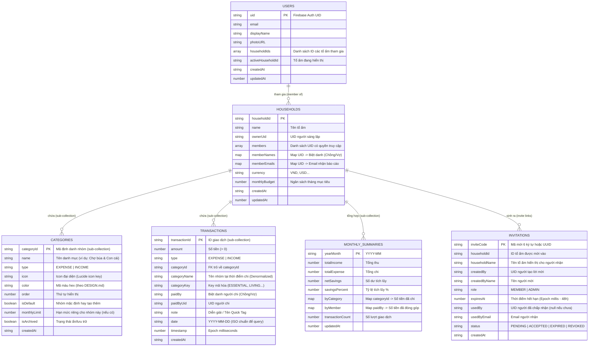

# THIẾT KẾ CƠ SỞ DỮ LIỆU ĐA GIA ĐÌNH (MULTI-TENANT FIRESTORE DATA MODEL)
### Dự Án: "Tổ Ấm Nhỏ" — Family Expense Management

Tài liệu này định nghĩa chi tiết kiến trúc cơ sở dữ liệu **NoSQL Cloud Firestore** chuẩn **Multi-Tenant (Đa hộ gia đình)**, hỗ trợ tùy biến danh mục, phân quyền tài khoản Google, cơ chế tạo mã mời thành viên, cập nhật giao dịch nguyên tử và bảo mật phân lớp.

---

## 1. 🗺️ Sơ Đồ Cấu Trúc Thực Thể (ERD Diagram)



---

## 2. 🗂️ Chi Tiết Các Collections & Documents

### 2.1. Root Collection: `users/{userId}`
Lưu trữ thông tin định danh của người dùng sau khi đăng nhập Google OAuth. Giúp ứng dụng biết người dùng đang thuộc về những tổ ấm nào và đang mở tổ ấm nào.

- **Đường dẫn Document:** `users/{userId}` (trong đó `{userId}` chính là `request.auth.uid`).
- **Mẫu dữ liệu JSON:**
```json
{
  "uid": "google_uid_chong_123",
  "email": "chong.nguyen@gmail.com",
  "displayName": "Nguyễn Văn Chồng",
  "photoURL": "https://lh3.googleusercontent.com/a/...",
  "householdIds": ["household_to_am_nho_01"],
  "activeHouseholdId": "household_to_am_nho_01",
  "createdAt": "2026-09-04T08:00:00Z",
  "updatedAt": 1788480000000
}
```

---

### 2.2. Root Collection: `households/{householdId}`
Đại diện cho một không gian tài chính gia đình riêng biệt (Tenant).

- **Đường dẫn Document:** `households/{householdId}`
- **Mẫu dữ liệu JSON:**
```json
{
  "name": "Tổ Ấm Nhỏ",
  "ownerUid": "google_uid_chong_123",
  "members": [
    "google_uid_chong_123",
    "google_uid_vo_456"
  ],
  "memberNames": {
    "google_uid_chong_123": "Chồng",
    "google_uid_vo_456": "Vợ"
  },
  "memberEmails": {
    "google_uid_chong_123": "chong.nguyen@gmail.com",
    "google_uid_vo_456": "vo.le@gmail.com"
  },
  "currency": "VND",
  "monthlyBudget": 40000000,
  "createdAt": "2026-09-01T00:00:00Z",
  "updatedAt": 1788480000000
}
```

---

### 2.3. Sub-collection: `households/{householdId}/categories/{categoryId}`
Quản lý các nhóm danh mục chi tiêu riêng của từng gia đình. Khi gia đình mới được tạo, hệ thống tự sinh 4 nhóm mặc định theo chuẩn [DESIGN.md](../DESIGN.md).

- **Mẫu dữ liệu JSON:**
```json
{
  "id": "cat_essential",
  "name": "Tổ ấm & Con cái",
  "type": "EXPENSE",
  "categoryKey": "ESSENTIAL",
  "icon": "home",
  "color": "#0F3D39",
  "order": 1,
  "isDefault": true,
  "monthlyLimit": 20000000,
  "isArchived": false,
  "createdAt": "2026-09-01T00:00:00Z"
}
```

> [!TIP]
> **4 Danh Mục Mặc Định Khi Tạo Tổ Ấm Mới:**
> 1. `cat_essential`: "Tổ ấm & Con cái" (`#0F3D39` - Pine Emerald)
> 2. `cat_living`: "Sinh hoạt & Hẹn hò" (`#4A6B68` - Muted Sage)
> 3. `cat_unexpected`: "Sức khỏe & Đột xuất" (`#92400E` - Warm Amber)
> 4. `cat_saving`: "Tích lũy & Tương lai" (`#10B981` - Emerald Green)

---

### 2.4. Sub-collection: `households/{householdId}/transactions/{transactionId}`
Chi tiết từng khoản chi tiêu hoặc thu nhập hàng ngày.

- **Mẫu dữ liệu JSON:**
```json
{
  "amount": 350000,
  "type": "EXPENSE",
  "categoryId": "cat_essential",
  "categoryName": "Tổ ấm & Con cái",
  "categoryKey": "ESSENTIAL",
  "paidBy": "Chồng",
  "paidByUid": "google_uid_chong_123",
  "note": "Chợ & Siêu thị",
  "date": "2026-09-04",
  "timestamp": 1788480000000,
  "createdAt": "2026-09-04T10:30:00Z"
}
```

---

### 2.5. Sub-collection: `households/{householdId}/monthly_summaries/{YYYY-MM}`
Document tính sẵn số liệu tổng hợp trong tháng (**Aggregated Document Pattern**).

- **Ví dụ Document ID:** `2026-09`
- **Mẫu dữ liệu JSON:**
```json
{
  "yearMonth": "2026-09",
  "totalIncome": 63000000,
  "totalExpense": 33840000,
  "netSavings": 29160000,
  "savingsPercent": 46,
  "byCategory": {
    "cat_essential": 16850000,
    "cat_living": 340000,
    "cat_unexpected": 1650000,
    "cat_saving": 15000000
  },
  "byMember": {
    "Chồng": 27340000,
    "Vợ": 6500000
  },
  "transactionCount": 42,
  "updatedAt": 1788480000000
}
```

---

### 2.6. Root Collection: `invitations/{inviteCode}`
Quản lý các liên kết hoặc mã mời gia nhập tổ ấm có thời hạn 48 giờ.

- **Mẫu dữ liệu JSON:**
```json
{
  "inviteCode": "TOAM-7892",
  "householdId": "household_to_am_nho_01",
  "householdName": "Tổ Ấm Nhỏ",
  "createdBy": "google_uid_chong_123",
  "createdByName": "Chồng",
  "role": "MEMBER",
  "expiresAt": 1788652800000,
  "usedBy": null,
  "usedByEmail": null,
  "status": "PENDING",
  "createdAt": "2026-09-04T10:00:00Z"
}
```

---

## 3. ⚡ Cập Nhật Nguyên Tử (Atomic Transactions)

### 3.1. Thêm Giao Dịch & Cập Nhật Tức Thì Tổng Hợp Tháng
```typescript
import { doc, runTransaction, increment, collection } from "firebase/firestore";
import { db } from "../services/firebase";

export async function addTransactionWithSummary(
  householdId: string,
  txData: {
    amount: number;
    type: "EXPENSE" | "INCOME";
    categoryId: string;
    categoryName: string;
    categoryKey: string;
    paidBy: string;
    paidByUid: string;
    note: string;
    date: string; // "YYYY-MM-DD"
  }
) {
  const yearMonth = txData.date.substring(0, 7); // "YYYY-MM"
  const summaryRef = doc(db, `households/${householdId}/monthly_summaries/${yearMonth}`);
  const newTxRef = doc(collection(db, `households/${householdId}/transactions`));

  await runTransaction(db, async (transaction) => {
    // 1. Lưu bản ghi giao dịch
    transaction.set(newTxRef, {
      ...txData,
      timestamp: Date.now(),
      createdAt: new Date().toISOString()
    });

    // 2. Cập nhật cộng dồn số liệu tháng
    const isExpense = txData.type === "EXPENSE";
    const amount = txData.amount;

    transaction.set(summaryRef, {
      yearMonth,
      totalExpense: isExpense ? increment(amount) : increment(0),
      totalIncome: !isExpense ? increment(amount) : increment(0),
      [`byCategory.${txData.categoryId}`]: isExpense ? increment(amount) : increment(0),
      [`byMember.${txData.paidBy}`]: isExpense ? increment(amount) : increment(0),
      transactionCount: increment(1),
      updatedAt: Date.now()
    }, { merge: true });
  });
}
```

### 3.2. Chấp Nhận Lời Mời Gia Nhập Tổ Ấm (Accept Invitation)
```typescript
export async function acceptInvitation(
  inviteCode: string, 
  user: { uid: string; email: string; displayName: string }
) {
  const inviteRef = doc(db, `invitations/${inviteCode}`);
  
  await runTransaction(db, async (transaction) => {
    const inviteSnap = await transaction.get(inviteRef);
    if (!inviteSnap.exists()) throw new Error("Mã mời không tồn tại.");

    const invite = inviteSnap.data();
    if (invite.status !== "PENDING" || invite.expiresAt < Date.now()) {
      throw new Error("Mã mời đã hết hạn hoặc đã được sử dụng.");
    }

    const householdRef = doc(db, `households/${invite.householdId}`);
    const userRef = doc(db, `users/${user.uid}`);

    // 1. Cập nhật trạng thái mã mời
    transaction.update(inviteRef, {
      status: "ACCEPTED",
      usedBy: user.uid,
      usedByEmail: user.email,
      acceptedAt: new Date().toISOString()
    });

    // 2. Thêm người dùng vào danh sách thành viên gia đình
    transaction.update(householdRef, {
      members: arrayUnion(user.uid),
      [`memberNames.${user.uid}`]: user.displayName,
      [`memberEmails.${user.uid}`]: user.email,
      updatedAt: Date.now()
    });

    // 3. Cập nhật hồ sơ người dùng
    transaction.set(userRef, {
      householdIds: arrayUnion(invite.householdId),
      activeHouseholdId: invite.householdId,
      updatedAt: Date.now()
    }, { merge: true });
  });
}
```

---

## 4. 🔒 Bộ Quy Tắc Bảo Mật Đa Hộ Gia Đình (Security Rules)

Đảm bảo dữ liệu giữa các gia đình được cô lập tuyệt đối (Zero Cross-tenant Leaks):

```javascript
rules_version = '2';
service cloud.firestore {
  match /databases/{database}/documents {
    
    // Kiểm tra đăng nhập
    function isAuthenticated() {
      return request.auth != null;
    }

    // Kiểm tra thành viên của hộ gia đình
    function isHouseholdMember(householdId) {
      return isAuthenticated() && 
        request.auth.uid in get(/databases/$(database)/documents/households/$(householdId)).data.members;
    }

    // 1. Hồ sơ người dùng: Chỉ chính chủ mới có quyền đọc và sửa
    match /users/{userId} {
      allow read, write: if isAuthenticated() && request.auth.uid == userId;
    }

    // 2. Không gian hộ gia đình
    match /households/{householdId} {
      // Cho phép tạo tổ ấm mới nếu đã đăng nhập
      allow create: if isAuthenticated();
      // Cho phép đọc/sửa nếu là thành viên của tổ ấm
      allow read, update: if isHouseholdMember(householdId);
      allow delete: if isAuthenticated() && resource.data.ownerUid == request.auth.uid;

      // 2.1. Quản lý danh mục
      match /categories/{categoryId} {
        allow read, write: if isHouseholdMember(householdId);
      }

      // 2.2. Chi tiết giao dịch
      match /transactions/{transactionId} {
        allow read, write: if isHouseholdMember(householdId);
      }

      // 2.3. Bảng tổng hợp tháng
      match /monthly_summaries/{yearMonth} {
        allow read, write: if isHouseholdMember(householdId);
      }
    }

    // 3. Hệ thống mã mời
    match /invitations/{inviteCode} {
      // Người đã đăng nhập được đọc mã để xác thực trước khi gia nhập
      allow read: if isAuthenticated();
      // Chỉ thành viên của tổ ấm mới được tạo mã mời
      allow create: if isAuthenticated() && isHouseholdMember(request.resource.data.householdId);
      // Người nhận được cập nhật trạng thái khi gia nhập
      allow update: if isAuthenticated();
    }
  }
}
```

---

## 5. 🔍 Chỉ Mục Kết Hợp (Composite Indexes)

Cấu hình trong `firestore.indexes.json` để tối ưu các truy vấn lọc:

```json
{
  "indexes": [
    {
      "collectionGroup": "transactions",
      "queryScope": "COLLECTION",
      "fields": [
        { "fieldPath": "date", "order": "DESCENDING" },
        { "fieldPath": "timestamp", "order": "DESCENDING" }
      ]
    },
    {
      "collectionGroup": "transactions",
      "queryScope": "COLLECTION",
      "fields": [
        { "fieldPath": "categoryId", "order": "ASCENDING" },
        { "fieldPath": "date", "order": "DESCENDING" }
      ]
    },
    {
      "collectionGroup": "transactions",
      "queryScope": "COLLECTION",
      "fields": [
        { "fieldPath": "paidBy", "order": "ASCENDING" },
        { "fieldPath": "date", "order": "DESCENDING" }
      ]
    }
  ],
  "fieldOverrides": []
}
```
