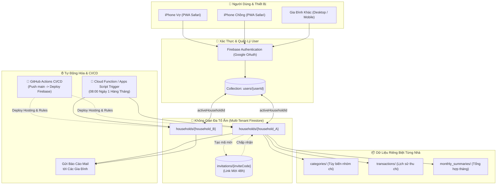
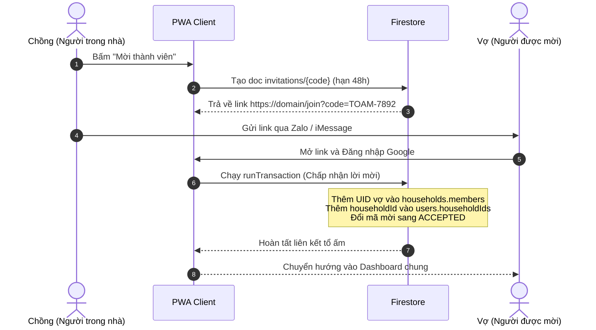

# TỔNG THỂ DỰ ÁN: "TỔ ẤM NHỎ"
### Family Expense Management PWA — Nền Tảng Quản Lý Chi Tiêu Gia Đình Đa Hộ (Multi-Tenant)

---

## 1. 🎯 Mục Tiêu & Tôn Chỉ Thiết Kế (Core Philosophy)

### 1.1. Chống nản khi nhập liệu (Anti-Friction)
- **Tốc độ tối đa:** Thời gian nhập 1 giao dịch dưới **3–5 giây** bằng một tay trên điện thoại.
- **Tối giản trường dữ liệu:** Chỉ cần **Số tiền $\rightarrow$ Nhóm chi (hoặc Quick Tag 1-chạm) $\rightarrow$ Người chi (Vợ/Chồng)**.
- **Không áp lực ghi chú:** Không bắt buộc nhập ghi chú dài dòng, loại bỏ hoàn toàn phân loại con tầng tầng lớp lớp gây nản lòng.

### 1.2. Thẩm mỹ ấm cúng, tinh tế (Tuân thủ triết lý [DESIGN.md](../DESIGN.md))
- **Nói không với "AI Generic":** Không sử dụng phong cách nền đen tím neon hay hiệu ứng bóng bẩy vô nghĩa.
- **Bảng màu tổ ấm:** Lấy cảm hứng từ giấy ngà (Warm Alabaster `#FAF9F6`), đất nung mộc (Terracotta `#B45309`), xanh ngọc bích vững chãi (Pine Emerald `#0F3D39`) và mực in kế toán cổ điển.
- **Giao diện êm dịu:** Giảm tải căng thẳng tâm lý khi nhìn vào chi tiêu hàng tháng, biến việc theo dõi tài chính thành trải nghiệm gắn kết gia đình.

### 1.3. Trải nghiệm cơ học (Tactile Hardware Experience)
- **Custom Numpad:** Bàn phím số to rõ, dễ thao tác ngón cái một tay khi đang bế con hoặc xách đồ đi chợ.
- **Xúc giác & Âm thanh:** Âm thanh gõ gỗ nhẹ (wood-click) qua Web Audio API và phản hồi rung nhẹ (Haptic feedback) trên di động, tạo cảm giác bấm máy tính tiền cơ học thỏa mãn.

### 1.4. Minh bạch & Cân bằng
- Thay vì các biểu đồ tròn rực rỡ khó đọc, tập trung trực quan vào:
  1. **Cán cân chi tiêu Vợ - Chồng** (tỷ lệ đóng góp chi trả trong tháng).
  2. **Tỷ lệ tích lũy chung của tổ ấm** so với mục tiêu đề ra.

### 1.5. Mở rộng Đa Gia Đình (Multi-Tenant Ready)
- Hỗ trợ không giới hạn số lượng gia đình sử dụng độc lập trên cùng một nền tảng.
- Mỗi gia đình có thể tự do tùy chỉnh danh mục chi tiêu riêng, ngân sách tháng riêng và mời bạn đời/người thân tham gia qua liên kết 1-chạm.

---

## 2. 🏗️ Kiến Trúc Hệ Thống Đa Gia Đình (System Architecture)

---

## 3. 📂 Hệ Thống Danh Mục & Quick Tags (Categories)

### 3.1. Danh Mục Linh Hoạt Theo Từng Gia Đình
Thay vì cố định cứng, mỗi gia đình sở hữu một sub-collection `categories` riêng biệt:
- Mặc định khi tạo tổ ấm, hệ thống sinh sẵn **4 nhóm chuẩn**:
  1. `cat_essential`: **Tổ ấm & Con cái** (Tiền nhà, điện nước, chợ búa, học phí, bỉm sữa).
  2. `cat_living`: **Sinh hoạt & Hẹn hò** (Ăn ngoài, cà phê, xem phim, mua sắm).
  3. `cat_unexpected`: **Sức khỏe & Đột xuất** (Khám bệnh, thuốc men, sửa xe, hiếu hỉ).
  4. `cat_saving`: **Tích lũy & Tương lai** (Gửi tiết kiệm, mua vàng, quỹ khẩn cấp).
- Gia đình có thể tự do thêm các nhóm mới (ví dụ: *Nuôi thú cưng, Đầu tư cá nhân...*) hoặc đổi tên, đổi icon tùy ý.

### 3.2. Dải Quick Tags 1-Chạm (Dải vuốt ngang)
Chạm 1 lần để tự động điền cả diễn giải lẫn danh mục tương ứng:
- 🛒 Chợ & Siêu thị $\rightarrow$ `cat_essential`
- 🍼 Bỉm & Sữa $\rightarrow$ `cat_essential`
- 💡 Điện nước & Wifi $\rightarrow$ `cat_essential`
- ☕ Cà phê & Ăn ngoài $\rightarrow$ `cat_living`
- ⛽ Xăng xe & Đi lại $\rightarrow$ `cat_living`
- 💊 Khám & Thuốc $\rightarrow$ `cat_unexpected`
- 🛋️ Đồ gia dụng $\rightarrow$ `cat_unexpected`
- 🐷 Gửi heo đất chung $\rightarrow$ `cat_saving`

---

## 4. 🗄️ Thiết Kế Cơ Sở Dữ Liệu (Firestore Data Model)

> 📖 **Xem đặc tả chi tiết toàn bộ Schema, Transaction code và Security Rules tại:**  
> 👉 **[docs/DATABASE_DESIGN.md](./DATABASE_DESIGN.md)**

Tóm tắt các collection chính:
- **`users/{userId}`**: Quản lý tài khoản Google, danh sách `householdIds` và `activeHouseholdId`.
- **`households/{householdId}`**: Không gian tổ ấm riêng biệt, ngân sách tháng, danh sách thành viên `members`.
  - **`categories/{categoryId}`**: Quản lý danh mục thu chi riêng của từng nhà.
  - **`transactions/{transactionId}`**: Chi tiết từng khoản chi tiêu với `date` dạng chuẩn `YYYY-MM-DD`.
  - **`monthly_summaries/{YYYY-MM}`**: Bảng tổng kết số liệu tính sẵn theo tháng (**Aggregated Pattern**).
- **`invitations/{inviteCode}`**: Mã mời gia nhập tổ ấm có hạn 48 giờ.

---

## 5. 💌 Cơ Chế Mời Thành Viên (Invite Member Flow)

---

## 6. 📧 Báo Cáo Định Kỳ Đa Gia Đình (Monthly Dispatch Email)

- **Thời điểm kích hoạt:** 08:00 AM ngày 01 hàng tháng.
- **Quy trình gửi hàng loạt:**
  1. Cron Trigger quét danh sách tất cả các `households` đang hoạt động.
  2. Đọc doc `monthly_summaries/{thang_truoc}` của từng nhà.
  3. Render giao diện HTML **"Bức thư tháng"** ấm áp mang sắc màu Terracotta & Pine Emerald.
  4. Gửi đồng thời tới toàn bộ danh sách `memberEmails` của từng gia đình qua dịch vụ email chuyên nghiệp.

---

## 7. 🚀 Tự Động Hóa CI/CD Với GitHub Actions

- **Tệp cấu hình:** [.github/workflows/firebase-deploy.yml](../.github/workflows/firebase-deploy.yml)
- **Cơ chế:** Khi có commit mới được push vào nhánh `main`:
  1. Chạy linter kiểm tra chuẩn thiết kế: `npm run lint:design` (yêu cầu 0 errors, 0 warnings).
  2. Cài đặt dependencies và build mã nguồn Frontend: `npm run build`.
  3. Sử dụng token bí mật `FIREBASE_SERVICE_ACCOUNT` trong GitHub Secrets để tự động deploy:
     - **Firebase Hosting** (mã nguồn PWA).
     - **Firestore Security Rules** (`firestore.rules`).
     - **Firestore Composite Indexes** (`firestore.indexes.json`).

---

## 8. 🛣️ Lộ Trình Triển Khai (Development Roadmap)

### Giai đoạn 1: Nền tảng & Data Architecture *(Hoàn thành)*
- [x] Thiết lập hệ thống thiết kế [DESIGN.md](../DESIGN.md) (`Harmony Ledger`).
- [x] Xuất các biến tokens [tokens.css](../src/styles/tokens.css) & [theme.css](../src/styles/theme.css).
- [x] Thiết kế hoàn chỉnh CSDL Đa gia đình trong [DATABASE_DESIGN.md](./DATABASE_DESIGN.md).
- [x] Chuẩn hóa toàn bộ đặc tả dự án trong [PROJECT_SPEC.md](./PROJECT_SPEC.md).

### Giai đoạn 2: Khởi tạo Cấu hình CI/CD & Firebase Rules
- [ ] Tạo file Security Rules chính thức [firestore.rules](../firestore.rules).
- [ ] Tạo cấu hình Composite Indexes [firestore.indexes.json](../firestore.indexes.json).
- [ ] Cấu hình [firebase.json](../firebase.json) cho PWA rewrite.
- [ ] Thiết lập GitHub Actions Workflow [.github/workflows/firebase-deploy.yml](../.github/workflows/firebase-deploy.yml).

### Giai đoạn 3: Phát triển Giao diện PWA (React + Vite + TypeScript)
- [ ] Khởi tạo dự án React 19 + TypeScript + Vite.
- [ ] Cài đặt `vite-plugin-pwa` với Web App Manifest và cấu hình iOS Standalone icon.
- [ ] Xây dựng Custom Numpad xúc giác tích hợp Web Audio API (âm gõ gỗ) và rung Haptic.
- [ ] Xây dựng màn hình Dashboard, Quick Tags, Quản lý danh mục và Mời thành viên.

### Giai đoạn 4: Tích hợp Firebase Realtime & Báo Cáo Tự Động
- [ ] Tích hợp Google OAuth và đồng bộ realtime qua `onSnapshot`.
- [ ] Kích hoạt Firestore Offline Persistence (`IndexedDB`).
- [ ] Triển khai script gửi Báo cáo định kỳ ngày mùng 1 hàng tháng.
