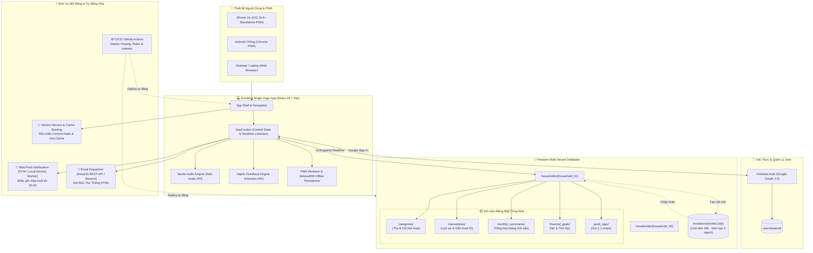
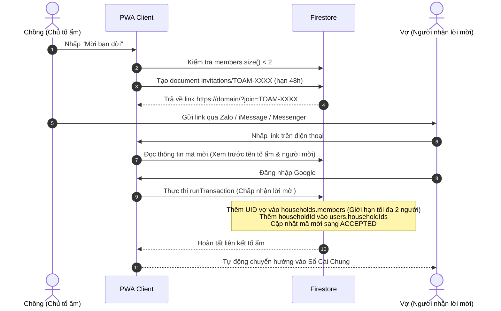

# TỔNG THỂ DỰ ÁN: "TỔ ẤM NHỎ"
### Family Expense Management PWA — Nền Tảng Quản Lý Chi Tiêu Gia Đình Đa Hộ (Multi-Tenant)

---

## 1. 🎯 Mục Tiêu & Tôn Chỉ Thiết Kế (Core Philosophy)

### 1.1. Chống nản khi nhập liệu (Anti-Friction)
- **Tốc độ tối đa:** Thời gian nhập một giao dịch thu chi dưới **3–5 giây** bằng một tay trên điện thoại.
- **Tối giản trường dữ liệu:** Luồng nhập trực quan: **Số tiền $\rightarrow$ Nhóm chi / thu (hoặc Quick Tag 1-chạm) $\rightarrow$ Người chi (Vợ/Chồng) $\rightarrow$ Lưu**.
- **Không áp lực ghi chú:** Không bắt buộc nhập mô tả dài dòng, loại bỏ cấu trúc phân loại con nhiều tầng gây căng thẳng tâm lý.

### 1.2. Thẩm mỹ ấm cúng, tinh tế (Tuân thủ chuẩn [DESIGN.md](../DESIGN.md))
- **Nói không với giao diện AI Generic:** Loại bỏ triệt để nền đen bóng tím neon hay gradient chói mắt.
- **Bảng màu tổ ấm Harmony Ledger:** Lấy cảm hứng từ chất liệu tự nhiên: giấy ngà (*Warm Alabaster* `#FAF9F6`), đất nung mộc (*Terracotta* `#B45309`), xanh ngọc bích vững chãi (*Pine Emerald* `#0F3D39`) và hổ phách ấm áp (*Warm Amber* `#D97706`).
- **Giao diện êm dịu:** Giảm tải căng thẳng tâm lý khi nhìn vào con số tài chính, biến việc ghi chép thành khoảnh khắc kết nối của hai vợ chồng.

### 1.3. Trải nghiệm cơ học xúc giác (Tactile Hardware Experience)
- **Custom Numpad:** Bàn phím số to rõ, bố trí công thái học ngón tay cái thuận tiện khi bế con hoặc xách đồ đi chợ.
- **Âm thanh gõ gỗ (Wood-click):** Tích hợp qua native `Web Audio API` mô phỏng tiếng máy bấm số cơ học thỏa mãn.
- **Phản hồi rung xúc giác (Haptics):** Tích hợp `navigator.vibrate` phản hồi tinh tế trên điện thoại di động.

### 1.4. Minh bạch, cân bằng & dự phóng thông minh
- Trực quan hóa tài chính bằng các chỉ số có ý nghĩa thực tiễn:
  1. **Cán cân chi tiêu Vợ - Chồng:** Tỷ lệ đóng góp chi trả và thu nhập của từng người trong tháng.
  2. **Tỷ lệ tích lũy chung:** Số dư tích lũy (`Net Savings`) và tỷ lệ tích lũy (`Savings Ratio %`) so với tổng thu nhập.
  3. **Dự phóng chi tiêu tháng (Burn Rate):** Ước tính tổng chi tiêu cuối tháng dựa trên tốc độ tiêu tiền trung bình mỗi ngày.
  4. **Bộ lọc loại trừ danh mục:** Cho phép tách riêng các khoản Trả nợ / Tích lũy lớn để nhìn rõ chi phí sinh hoạt thuần túy.

### 1.5. Không gian gia đình riêng tư & Đa gia đình (Multi-Tenant)
- Hỗ trợ không giới hạn số lượng gia đình sử dụng độc lập trên cùng nền tảng.
- Mỗi tổ ấm được thiết kế chuẩn mực cho **tối đa 2 thành viên đồng hành (Vợ & Chồng)**, đảm bảo tính riêng tư, bảo mật và sự gắn kết sâu sắc.

### 1.6. Mục tiêu Tự do Tài chính (Financial Freedom)
- Quản lý song song **Khoản nợ trả góp** (`DEBT_PAYOFF`) và **Quỹ tích lũy tương lai** (`SAVINGS`).
- Tự động khấu trừ dư nợ hoặc cộng dồn quỹ tích lũy ngay khi phát sinh giao dịch liên kết.

---

## 2. 🏗️ Kiến Trúc Hệ Thống Toàn Diện (System Architecture)



---

## 3. 📁 Cấu Trúc Mã Nguồn Dự Án (Project Structure)

```text
family-expense-manager/
├── .github/
│   └── workflows/
│       └── firebase-deploy.yml    # CI/CD tự động deploy Firebase Hosting, Rules, Indexes
├── docs/
│   ├── DATABASE_DESIGN.md        # Thiết kế NoSQL Firestore, Schema, Atomic Ops, Security Rules
│   └── PROJECT_SPEC.md           # Tổng thể dự án, kiến trúc, tính năng và lộ trình
├── public/
│   ├── favicon.ico
│   ├── firebase-messaging-sw.js  # Service Worker nhận Web Push FCM trong nền
│   ├── version.json              # File metadata phiên bản tự sinh trong quá trình build
│   └── vite.svg
├── src/
│   ├── components/               # Các khối giao diện người dùng
│   │   ├── BalanceCard.tsx       # Thẻ tổng quan tài chính tháng (Thu, Chi, Tích lũy, Cán cân)
│   │   ├── BottomNav.tsx         # Thanh điều hướng đáy trên di động (Ledger, Report, Numpad, Goals, Family)
│   │   ├── CategoryBreakdown.tsx # Bảng phân tích chi tiêu theo từng nhóm danh mục
│   │   ├── CategoryManager.tsx   # Quản lý Danh mục (Thu/Chi) & Quản lý Phím tắt Quick Tags
│   │   ├── DailySpendingChart.tsx# Biểu đồ cột chi tiêu từng ngày trong tháng
│   │   ├── Dashboard.tsx         # Báo cáo dòng tiền, cán cân Vợ/Chồng, burn rate & dự phóng
│   │   ├── EditTransactionModal.tsx # Modal chỉnh sửa / xóa giao dịch chi tiết
│   │   ├── ErrorBoundary.tsx     # Bắt lỗi runtime chống crash ứng dụng
│   │   ├── FamilyHub.tsx         # Trung tâm tổ ấm: Quản lý thành viên, đổi tên, ngân sách, danh mục
│   │   ├── FinancialFreedom.tsx  # Quản lý Mục tiêu Tự do Tài chính (Khoản nợ & Tích lũy)
│   │   ├── Header.tsx            # Đầu trang ứng dụng & chuyển đổi view Desktop
│   │   ├── InviteModal.tsx       # Modal tạo mã mời và tham gia tổ ấm qua link 48h
│   │   ├── MonthPicker.tsx       # Bộ chọn tháng linh hoạt (trước / sau / hiện tại)
│   │   ├── MonthlyLetterModal.tsx# Giao diện xem trước "Bức thư tháng" ấm cúng
│   │   ├── Numpad.tsx            # Bàn phím số cơ học xúc giác (Custom Tactile Keypad)
│   │   ├── QuickTags.tsx         # Dải phím tắt gợi ý 1-chạm vuốt ngang
│   │   ├── ReportCategoryFilterModal.tsx # Modal lọc loại trừ danh mục trên báo cáo
│   │   ├── SendReportEmailModal.tsx # Soạn & Gửi email báo cáo HTML (EmailJS / Resend)
│   │   ├── SettingsModal.tsx     # Cài đặt âm thanh, rung, thông báo đẩy, kiểm tra cập nhật
│   │   ├── SpendingHistoryModal.tsx # Modal xem danh sách giao dịch theo Ngày hoặc Danh mục
│   │   ├── Toast.tsx             # Thông báo nhanh toast feedback người dùng
│   │   ├── TransactionList.tsx   # Sổ cái danh sách giao dịch nhóm theo ngày
│   │   └── UpdateNotification.tsx# Thanh thông báo khi có bản cập nhật code mới
│   ├── context/
│   │   └── AppContext.tsx        # Central State Management & Firestore Realtime Sync
│   ├── services/
│   │   ├── emailService.ts       # Sinh HTML Email responsive & gửi qua EmailJS / Resend
│   │   ├── firebase.ts           # Khởi tạo Firebase App, Auth, Firestore (IndexedDB cache), Messaging
│   │   ├── firestoreService.ts   # Toàn bộ CRUD & Atomic Transactions Firestore
│   │   ├── mockData.ts           # Dữ liệu mẫu chuẩn bị sẵn cho trải nghiệm demo
│   │   ├── notificationService.ts# Web Push Notification, Local Notification & Daily Reminder
│   │   └── versionService.ts     # Kiểm tra phiên bản server, commit hash & dọn dẹp Cache Storage
│   ├── styles/
│   │   ├── global.css            # Custom CSS, hiệu ứng tactile, scrollbar ẩn, safe-area
│   │   ├── theme.css             # Tailwind CSS v4 Theme (@theme)
│   │   └── tokens.css            # Biến CSS Custom Properties (:root) từ DESIGN.md
│   ├── types/
│   │   └── index.ts              # Toàn bộ TypeScript interfaces & types của dự án
│   ├── utils/
│   │   ├── audio.ts              # Native Web Audio API (Wood-click & Success chime)
│   │   ├── categoryIcons.tsx     # Dynamic Lucide Icon Mapper cho danh mục & mục tiêu
│   │   ├── currency.ts           # Định dạng tiền tệ VND, compact VND, ngày tháng tiếng Việt
│   │   ├── goalSorting.ts        # Thuật toán sắp xếp mục tiêu theo độ ưu tiên & tiến độ
│   │   └── haptics.ts            # Haptic vibration wrapper an toàn
│   ├── App.tsx                   # Layout gốc điều phối view Di động & Máy tính
│   ├── main.tsx                  # Điểm khởi động ứng dụng React
│   └── vite-env.d.ts             # Khai báo môi trường Vite
├── firebase.json                 # Cấu hình Firebase Hosting SPA rewrites & Rules
├── firestore.indexes.json        # Cấu hình Composite Indexes Firestore
├── firestore.rules               # Bộ quy tắc bảo mật Firestore Multi-Tenant
├── package.json                  # Dependencies & npm scripts
├── vite.config.ts                # Cấu hình Vite, Tailwind v4, PWA Plugin, Version Generator
└── DESIGN.md                     # Đặc tả hệ thống thiết kế chuẩn Google Labs
```

---

## 4. 🗃️ Thiết Kế Cơ Sở Dữ Liệu (Firestore Data Model)

> 📖 **Xem tài liệu đặc tả toàn diện về Schema, Atomic Transactions và Security Rules tại:**  
> 👉 **[docs/DATABASE_DESIGN.md](./DATABASE_DESIGN.md)**

Tóm tắt các bộ sưu tập chính:
- **`users/{userId}`**: Quản lý định danh Google OAuth, danh sách `householdIds`, `activeHouseholdId` và `role`.
- **`households/{householdId}`**: Không gian tổ ấm độc lập, ngân sách tháng, danh sách thành viên `members` (giới hạn tối đa 2 người: Vợ & Chồng).
  - **`categories/{categoryId}`**: Quản lý danh mục Thu & Chi riêng của từng nhà.
  - **`transactions/{transactionId}`**: Lịch sử thu chi từng ngày, hỗ trợ liên kết `goalId`.
  - **`monthly_summaries/{YYYY-MM}`**: Bảng tổng hợp tháng tính sẵn (**Aggregated Document Pattern**).
  - **`financial_goals/{goalId}`**: Quản lý mục tiêu trả nợ và tích lũy tài chính.
  - **`quick_tags/{tagId}`**: Quản lý các nút bấm gợi ý 1-chạm cho Chi tiêu & Thu nhập.
- **`invitations/{inviteCode}`**: Mã mời gia nhập tổ ấm định dạng `TOAM-XXXX` có hạn 48 giờ.

---

## 5. 🌟 Các Module Tính Năng Nổi Bật

### 5.1. Bàn Phím Số Xúc Giác & Gợi Ý 1-Chạm (Tactile Numpad & Quick Tags)
- Chuyển đổi nhanh 2 chế độ: **Chi tiêu (EXPENSE)** và **Thu nhập (INCOME)**.
- **Dải Quick Tags 1-chạm:** Tự động điền cả tên khoản chi/thu, icon, danh mục và số tiền gợi ý.
  - *Chi tiêu:* 🛒 Chợ & Siêu thị, ☕ Cà phê, 🍜 Ăn ngoài, ⛽ Xăng xe, 🍼 Bỉm sữa, 💡 Điện nước, 💊 Thuốc men...
  - *Thu nhập:* 💼 Lương cơ bản, 🧧 Thưởng, 📈 Lãi tiết kiệm, 🎁 Quà tặng...
- **Phản hồi tức thì:** Âm thanh gõ gỗ nhẹ (*wood-click*) và phản hồi rung cơ học (*haptic*) mang lại cảm giác bấm máy tính tiền cơ khí.

### 5.2. Mục Tiêu Tự Do Tài Chính (Financial Freedom)
- Phân loại rõ ràng 2 dạng bài toán tài chính gia đình:
  - **Trả nợ (`DEBT_PAYOFF`):** Quản lý nợ ngân hàng, vay mua nhà, mua xe. Khi chi tiêu chọn mục tiêu này, số dư nợ sẽ tự động khấu trừ giảm dần về 0đ.
  - **Tích lũy (`SAVINGS`):** Quản lý quỹ khẩn cấp, mua vàng, du lịch, tương lai con cái. Số tiền tích lũy tăng dần tới đích.
- **Liên kết giao dịch:** Trong màn hình Numpad hoặc modal chỉnh sửa, người dùng có thể gắn giao dịch vào mục tiêu tương ứng.
- **Lịch sử giao dịch mục tiêu:** Nhấp vào mục tiêu để xem toàn bộ lịch sử các khoản tiền đã trả nợ hoặc nạp quỹ.

### 5.3. Dashboard Phân Tích Dòng Tiền & Dự Phóng Chi Tiêu
- **Cán cân Chồng vs Vợ:** Trực quan hóa tỷ lệ phần trăm và số tiền đóng góp của từng người.
- **Dự phóng chi tiêu tháng (Burn Rate):** Dự báo tổng chi tiêu cuối tháng dựa vào tốc độ tiêu tiền bình quân mỗi ngày, cảnh báo kịp thời nếu có nguy cơ vượt ngân sách.
- **Biểu đồ chi tiêu từng ngày (`DailySpendingChart`):** Cột biểu đồ tương tác, nhấp vào ngày bất kỳ để xem danh sách giao dịch chi tiết và chỉnh sửa.
- **Bộ lọc loại trừ danh mục:** Cho phép loại trừ tạm thời các khoản trả nợ/tiết kiệm lớn khỏi báo cáo để phản ánh chính xác chi phí sinh hoạt thường nhật.

### 5.4. Bản Tin Báo Cáo Tháng HTML & Gửi Email Tự Động
- **Bức Thư Tháng (Monthly Letter):** Giao diện HTML responsive mang ngôn ngữ thiết kế Warm Linen & Deep Pine, hiển thị trang nhã trên cả điện thoại và máy tính.
- **Đa kênh gửi email:**
  1. Tích hợp trực tiếp **EmailJS REST API** kết nối với tài khoản Gmail của gia đình (miễn phí, không cần server trung gian).
  2. Hỗ trợ **Resend API** cho doanh nghiệp/hộ gia đình chuyên nghiệp.
  3. Hỗ trợ sao chép nội dung HTML 1-click hoặc gửi qua ứng dụng Mail mặc định.
- Tùy chọn người nhận linh hoạt: gửi cho Vợ, gửi cho Chồng hoặc gửi đồng thời cho cả hai.

### 5.5. Thông Báo Đẩy & Nhắc Nhở Buổi Tối (Notifications)
- Tương thích đa nền tảng: Hỗ trợ **Web Push Notifications qua Firebase Cloud Messaging (FCM)** và **Local Service Worker Notifications**.
- Tối ưu cho **iOS 16.4+ Standalone PWA** (khi thêm app vào Màn hình chính iPhone).
- **Nhắc nhở thông minh:** Tự động gửi thông báo dịu dàng sau **20:30 tối** nếu gia đình hôm nay chưa có giao dịch nào được ghi chép.

### 5.6. Tự Động Cập Nhật Phiên Bản & Xóa Cache Triệt Để (Version Service)
- Plugin Vite tự động nhúng mã Git commit hash ngắn và thời điểm build vào `version.json`.
- Ứng dụng tự động kiểm tra định kỳ trong nền. Khi có phiên bản mới:
  - Hiển thị thanh thông báo cập nhật trang nhã (`UpdateNotification`).
  - Hỗ trợ **1-click xóa sạch Cache Storage** của PWA, hủy đăng ký Service Worker cũ và tải phiên bản mới nhất mà không làm mất phiên đăng nhập.

---

## 6. 💌 Quy Trình Mời Thành Viên Đồng Hành (Invite Flow)



---

## 7. 🚀 Tự Động Hóa CI/CD Với GitHub Actions

- **Tệp cấu hình:** [.github/workflows/firebase-deploy.yml](../.github/workflows/firebase-deploy.yml)
- **Quy trình hoạt động:** Khi có commit mới được push vào nhánh `main`:
  1. Kiểm tra chuẩn thiết kế Google Labs: `npx @google/design.md lint DESIGN.md`.
  2. Biên dịch TypeScript và build PWA bundle: `npm run build`.
  3. Deploy tự động lên Firebase:
     - **Firebase Hosting** (mã nguồn PWA, service worker, asset icons).
     - **Firestore Security Rules** (`firestore.rules`).
     - **Firestore Composite Indexes** (`firestore.indexes.json`).

---

## 8. 🛣️ Trạng Thái Triển Khai Thực Tế (Roadmap Status)

### Giai đoạn 1: Nền tảng & Thiết kế Giao diện *(Đã hoàn thành)*
- [x] Thiết lập hệ thống thiết kế [DESIGN.md](../DESIGN.md) (`Harmony Ledger`).
- [x] Xuất các biến tokens [tokens.css](../src/styles/tokens.css) & [theme.css](../src/styles/theme.css).
- [x] Thiết kế hoàn chỉnh CSDL Đa gia đình trong [DATABASE_DESIGN.md](./DATABASE_DESIGN.md).
- [x] Chuẩn hóa toàn bộ đặc tả dự án trong [PROJECT_SPEC.md](./PROJECT_SPEC.md).

### Giai đoạn 2: Khởi tạo Cấu hình CI/CD & Firebase Rules *(Đã hoàn thành)*
- [x] Tạo file Security Rules chính thức [firestore.rules](../firestore.rules).
- [x] Tạo cấu hình Composite Indexes [firestore.indexes.json](../firestore.indexes.json).
- [x] Cấu hình [firebase.json](../firebase.json) cho PWA single page rewrites.
- [x] Thiết lập GitHub Actions Workflow [.github/workflows/firebase-deploy.yml](../.github/workflows/firebase-deploy.yml).

### Giai đoạn 3: Phát triển Ứng dụng PWA (React 19 + TypeScript + Vite) *(Đã hoàn thành)*
- [x] Khởi tạo dự án React 19 + TypeScript + Vite + Tailwind CSS v4.
- [x] Cài đặt `vite-plugin-pwa` với Web App Manifest và Service Worker offline caching.
- [x] Xây dựng Custom Numpad xúc giác tích hợp Web Audio API (âm gõ gỗ) và rung Haptic.
- [x] Xây dựng màn hình Sổ cái chi tiêu (`TransactionList`), Thẻ tài chính (`BalanceCard`), Bộ chọn tháng (`MonthPicker`).
- [x] Xây dựng Trung tâm tổ ấm (`FamilyHub`), Quản lý danh mục & Quick Tags (`CategoryManager`).
- [x] Xây dựng Modal tạo mã mời và gia nhập tổ ấm (`InviteModal`).

### Giai đoạn 4: Tính Năng Nâng Cao & Tự Động Hóa *(Đã hoàn thành)*
- [x] Tích hợp Google OAuth và đồng bộ realtime qua `onSnapshot`.
- [x] Kích hoạt Firestore Offline Persistence (`IndexedDB cache`).
- [x] Xây dựng Module Mục tiêu Tự do Tài chính (`FinancialFreedom`) quản lý nợ & tích lũy.
- [x] Xây dựng Dashboard phân tích dòng tiền, cán cân Vợ/Chồng, burn rate & biểu đồ chi tiêu từng ngày (`DailySpendingChart`).
- [x] Xây dựng tính năng Gửi email báo cáo tháng HTML đa nền tảng qua EmailJS REST API & Resend API.
- [x] Xây dựng dịch vụ Thông báo Web Push & Local Notifications nhắc nhở ghi chép buổi tối.
- [x] Xây dựng dịch vụ Quản lý phiên bản (`versionService`) tự động kiểm tra commit hash và dọn dẹp cache.
