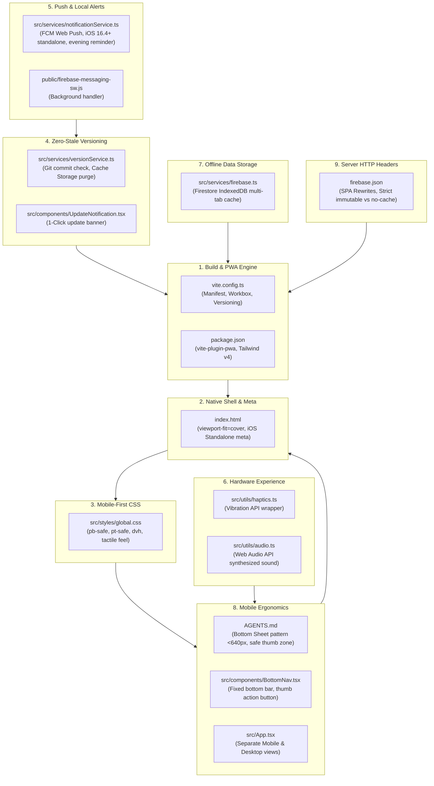

# KIẾN TRÚC & CẨM NANG CHUẨN PHÁT TRIỂN WEB APP HƯỚNG PWA
### Architectural Blueprint for Modern Progressive Web Applications (PWA)
> **Dự án tham chiếu chuẩn:** "Tổ Ấm Nhỏ" — Family Expense Management

Tài liệu này tổng hợp toàn bộ giải pháp kiến trúc, danh sách các tệp tin cốt lõi, mẫu mã nguồn và hướng dẫn từng bước để sử dụng repository này làm **khung mẫu (Blueprint / Template)** cho bất kỳ dự án Web App nào hướng tới trải nghiệm **Progressive Web App (PWA)** cao cấp, mượt mà và chuẩn mực như ứng dụng Native trên cả iOS và Android.

---

## 🗺️ 9 Trụ Cột Kiến Trúc PWA Cốt Lõi



---

## 1. ⚙️ Cấu Hình Build Pipeline & PWA Core

### 📄 [vite.config.ts](../vite.config.ts)
Trọng tâm cấu hình build của Vite kết hợp `vite-plugin-pwa`:
- **Chế độ kích hoạt tức thì (`registerType: 'autoUpdate'`):** Service Worker tự động nạp và kiểm tra cập nhật ngầm.
- **Web App Manifest:** Khai báo đầy đủ để trình duyệt hiển thị nút "Cài đặt ứng dụng":
  - `display: "standalone"`: Mở toàn màn hình không có thanh địa chỉ URL của trình duyệt.
  - `theme_color` & `background_color`: Đồng bộ màu sắc nền của hệ thống khi mở app.
  - `orientation: "portrait"`: Khóa chế độ màn hình dọc chuyên nghiệp.
  - `icons`: Khai báo 2 kích thước chuẩn `192x192` và `512x512`.
- **Workbox Caching Policy:**
  - `clientsClaim: true`, `skipWaiting: true`: Service Worker mới lập tức nắm quyền kiểm soát các tab đang mở.
  - `cleanupOutdatedCaches: true`: Tự động xóa các bản cache tài nguyên đã lỗi thời.
  - `globPatterns`: Lưu cache các định dạng tĩnh (`js,css,html,ico,png,svg,woff2`).
- **Custom Vite Plugin (`versionFilePlugin`):**
  - Tự động thực thi `git rev-parse --short HEAD` và lấy `version` từ `package.json` trong quá trình build.
  - Tự sinh tệp `version.json` vào cả thư mục `public/` và `dist/`.
- **Bơm hằng số toàn cục (define):** Cung cấp `__APP_VERSION__`, `__COMMIT_HASH__`, `__BUILD_TIME__` cho mã nguồn Frontend.

```typescript
// Trích xuất cấu hình mẫu từ vite.config.ts
VitePWA({
  registerType: 'autoUpdate',
  manifest: {
    name: 'Tên Ứng Dụng PWA',
    short_name: 'AppShortName',
    display: 'standalone',
    orientation: 'portrait',
    start_url: '/',
    theme_color: '#FAF9F6',
    background_color: '#FAF9F6',
    icons: [
      { src: '/vite.svg', sizes: '192x192', type: 'image/svg+xml' },
      { src: '/vite.svg', sizes: '512x512', type: 'image/svg+xml' }
    ]
  },
  workbox: {
    globPatterns: ['**/*.{js,css,html,ico,png,svg,woff2}'],
    cleanupOutdatedCaches: true,
    clientsClaim: true,
    skipWaiting: true
  }
})
```

---

## 2. 📱 Khung Vỏ HTML & Tối Ưu Cho iOS Standalone

### 📄 [index.html](../index.html)
iOS Safari có những yêu cầu thẻ `<meta>` riêng biệt để biến một trang web thành Web App chuẩn mực:

```html
<!-- 1. Thuộc tính viewport-fit=cover để nội dung phủ tràn qua vùng tai thỏ / Dynamic Island -->
<meta name="viewport" content="width=device-width, initial-scale=1.0, maximum-scale=1.0, user-scalable=no, viewport-fit=cover" />

<!-- 2. Kích hoạt chế độ Web App Standalone trên iPhone / iPad -->
<meta name="apple-mobile-web-app-capable" content="yes" />
<meta name="apple-mobile-web-app-status-bar-style" content="default" />
<meta name="apple-mobile-web-app-title" content="Tổ Ấm Nhỏ" />
<meta name="theme-color" content="#FAF9F6" />
```

> [!IMPORTANT]
> `viewport-fit=cover` là tham số bắt buộc. Nếu thiếu tham số này, các hàm CSS `env(safe-area-inset-bottom)` hay `env(safe-area-inset-top)` trên iOS Safari sẽ luôn trả về `0px`.

---

## 3. 🎨 CSS Mobile-First: Safe Area Insets & Dynamic Viewport (`dvh`)

### 📄 [src/styles/global.css](../src/styles/global.css)
Giải quyết triệt để lỗi giao diện bị che lấp bởi thanh Home Indicator hoặc tai thỏ trên thiết bị di động:

```css
/* 1. Safe Area Padding bảo vệ đáy và đỉnh trên iPhone */
.pb-safe {
  padding-bottom: max(8px, env(safe-area-inset-bottom, 8px));
}

.pt-safe {
  padding-top: max(16px, calc(env(safe-area-inset-top, 0px) + 8px));
}

/* Định nghĩa utility tương thích Tailwind v4 */
@utility pb-safe {
  padding-bottom: max(8px, env(safe-area-inset-bottom, 8px));
}

@utility pt-safe {
  padding-top: max(16px, calc(env(safe-area-inset-top, 0px) + 8px));
}

/* 2. Chiều cao Viewport động (dvh): Không bị giật khi thanh URL Safari trượt lên/xuống */
.h-screen-dvh {
  height: 100dvh;
}

.min-h-screen-dvh {
  min-height: 100dvh;
}

/* 3. Tắt phản hồi chớp xanh/xám khó chịu của webview di động */
* {
  -webkit-tap-highlight-color: transparent;
}

/* 4. Cảm giác phím cơ lún xúc giác khi ngón tay nhấn xuống */
.tactile-btn {
  transition: transform 0.08s cubic-bezier(0.4, 0, 0.2, 1), background-color 0.15s ease, box-shadow 0.15s ease;
  user-select: none;
  -webkit-user-select: none;
}

.tactile-btn:active {
  transform: translateY(2px) scale(0.97);
  filter: brightness(0.96);
}

/* 5. Ẩn thanh cuộn ngang để vuốt ribbon mượt mà */
.no-scrollbar::-webkit-scrollbar {
  display: none;
}
.no-scrollbar {
  -ms-overflow-style: none;
  scrollbar-width: none;
}
```

---

## 4. 🔄 Quản Lý Phiên Bản & Cơ Chế "Xóa Cache Triệt Để" (Zero-Stale PWA)

Điểm yếu lớn nhất của các ứng dụng PWA truyền thống là **người dùng bị kẹt ở phiên bản cũ** do Service Worker lưu cache quá mức. Dự án này triển khai kiến trúc 2 lớp giải quyết dứt điểm:

### 📄 [src/services/versionService.ts](../src/services/versionService.ts)
1. **Kiểm tra phiên bản chủ động (`checkForUpdates`):**
   - Tải `/version.json?_t=${Date.now()}` kèm header `Cache-Control: no-cache, no-store`.
   - So sánh Git commit hash giữa máy khách (`currentHash`) và máy chủ (`remoteHash`).
   - Kích hoạt `reg.update()` trên tất cả Service Workers đang đăng ký.
2. **Hàm dọn dẹp cấp độ sâu (`forceClearCacheAndReload`):**
   - Thực hiện 1-click làm mới toàn diện:
     ```typescript
     // Bước 1: Xóa toàn bộ Cache Storage của trình duyệt
     const cacheNames = await caches.keys();
     await Promise.all(cacheNames.map((name) => caches.delete(name)));

     // Bước 2: Hủy đăng ký tất cả Service Workers
     const registrations = await navigator.serviceWorker.getRegistrations();
     await Promise.all(registrations.map((reg) => reg.unregister()));

     // Bước 3: Dọn sạch sessionStorage
     sessionStorage.clear();

     // Bước 4: Tải lại trang với query tham số bẻ cache
     window.location.replace(`/?_v=${Date.now()}`);
     ```

### 📄 [src/components/UpdateNotification.tsx](../src/components/UpdateNotification.tsx)
- Hiển thị thanh thông báo nổi tinh tế khi phát hiện có bản cập nhật mới.
- Người dùng chỉ cần nhấp nút **"Cập nhật ngay"**, ứng dụng sẽ tự động chạy cơ chế xóa sạch cache và nạp phiên bản mới nhất mà không làm mất phiên đăng nhập.

---

## 5. 🔔 Thông Báo Đẩy (Web Push) & Local Notifications

### 📄 [src/services/notificationService.ts](../src/services/notificationService.ts)
- **Hỗ trợ iOS 16.4+:** Apple chỉ cho phép Web Push khi ứng dụng được người dùng **"Thêm vào Màn hình chính"** (*Add to Home Screen - Standalone Mode*). Hàm `isIOSDevice()` và `isStandaloneMode()` tự động kiểm tra và hướng dẫn người dùng thực hiện.
- **Tích hợp kép:**
  1. **Firebase Cloud Messaging (FCM):** Lấy FCM Token qua `getToken(messaging, { vapidKey, serviceWorkerRegistration })`.
  2. **Local Notifications:** Sử dụng `registration.showNotification(title, options)` để gửi thông báo cục bộ ngay cả khi không có kết nối mạng.
- **Tính năng nhắc nhở thông minh:** Tự động kích hoạt nhắc nhở sau 20:30 tối nếu trong ngày chưa có thao tác.

### 📄 [public/firebase-messaging-sw.js](../public/firebase-messaging-sw.js)
Service Worker chạy nền độc lập tiếp nhận các gói thông báo đẩy khi ứng dụng đang đóng:
```javascript
importScripts('https://www.gstatic.com/firebasejs/10.8.0/firebase-app-compat.js');
importScripts('https://www.gstatic.com/firebasejs/10.8.0/firebase-messaging-compat.js');

self.addEventListener('notificationclick', function(event) {
  event.notification.close();
  event.waitUntil(clients.openWindow('/'));
});
```

---

## 6. 📳 Phản Hồi Xúc Giác & Âm Thanh Mô Phỏng Phần Cứng (Tactile Hardware)

Biến ứng dụng web thành một thiết bị phần cứng cơ học cao cấp mà **không cần tải các tệp `.mp3` nặng nề**:

### 📄 [src/utils/haptics.ts](../src/utils/haptics.ts)
```typescript
export function triggerHaptic(duration = 10): void {
  if (typeof window !== 'undefined' && 'vibrate' in navigator) {
    try {
      navigator.vibrate(duration);
    } catch {
      // Bỏ qua im lặng nếu trình duyệt không cấp quyền
    }
  }
}
```

### 📄 [src/utils/audio.ts](../src/utils/audio.ts)
Sử dụng trực tiếp native `Web Audio API` để tổng hợp sóng âm theo tần số:
- **Tiếng gõ gỗ cơ học (`playKeyClick`):** Tạo âm click gõ máy tính tiền nhẹ 800Hz $\rightarrow$ 120Hz dạng sóng `triangle` trong 0.04 giây.
- **Tiếng chuông hoàn tất (`playSuccessChime`):** Tạo chuỗi hợp âm ngân vang hai nốt E6 (1318Hz) và B6 (1975Hz) dạng sóng `sine`.

---

## 7. 💾 Lưu Trữ Dữ Liệu Ngoại Tuyến (Offline-First Persistence)

### 📄 [src/services/firebase.ts](../src/services/firebase.ts)
Cấu hình Cloud Firestore với bộ nhớ đệm ngoại tuyến nhiều tab thông qua IndexedDB:
```typescript
import { initializeFirestore, persistentLocalCache, persistentMultipleTabManager } from 'firebase/firestore';

export const db = initializeFirestore(app, {
  localCache: persistentLocalCache({
    tabManager: persistentMultipleTabManager()
  })
});
```
*Lợi ích:* Khi mất kết nối mạng (hoặc khi đi chợ trong tầng hầm), toàn bộ dữ liệu vẫn được đọc và ghi bình thường vào IndexedDB cục bộ; khi có mạng trở lại, Firestore sẽ tự động đồng bộ lên đám mây.

---

## 8. 📐 Quy Chuẩn Công Thái Học Di Động & Bottom Sheet Pattern

### 📄 [AGENTS.md](../AGENTS.md) (Mục `Mobile-First Responsiveness`)
- **Bottom Sheet Pattern Over Centered Modals:** Trên màn hình di động (`< 640px`), tất cả các hộp thoại (modal, form nhập liệu, chỉnh sửa, bộ lọc) **bắt buộc phải hiển thị dưới dạng Bottom Sheet trượt từ đáy màn hình lên** thay vì modal nổi ở giữa màn hình. Điều này tối ưu hóa tầm với của ngón cái (*thumb zone*).
- **Quy chuẩn kích thước & tầm nhìn hành động:**
  - Chiều cao Bottom Sheet: `h-[95dvh] max-h-[96dvh]`.
  - Bo góc trên chuẩn: `rounded-t-3xl`.
  - Loại bỏ các thanh drag-handle thừa làm chiếm diện tích dọc.
  - Vùng cuộn bên trong phải có padding đệm đáy (`pb-6` / `pb-8` kết hợp `pb-safe`) để các nút hành động chính (Submit / Lưu / Xác nhận) luôn hiển thị 100% nguyên vẹn phía trên thanh Home Indicator của iPhone.

### 📄 [src/components/BottomNav.tsx](../src/components/BottomNav.tsx)
- Thanh điều hướng đáy cố định (`fixed bottom-0 z-40 pb-safe sm:hidden`).
- Nút Action tâm điểm (+) thiết kế dạng nổi bo tròn lồi lên trên, dễ dàng thao tác nhanh một tay.

### 📄 [src/App.tsx](../src/App.tsx)
- Kiến trúc phân tách giao diện kép:
  - Di động: `<div className="sm:hidden">` chuyển đổi tab trơn tru.
  - Máy tính: `<div className="hidden sm:block">` bố cục 2 cột cân đối.

---

## 9. 🚀 Cấu Hình Máy Chủ & HTTP Cache-Control Cho PWA

### 📄 [firebase.json](../firebase.json)
Cấu hình máy chủ phân tầng bộ nhớ đệm nghiêm ngặt:

```json
{
  "hosting": {
    "public": "dist",
    "rewrites": [
      {
        "source": "**",
        "destination": "/index.html"
      }
    ],
    "headers": [
      {
        "source": "/assets/**",
        "headers": [
          { "key": "Cache-Control", "value": "public, max-age=31536000, immutable" }
        ]
      },
      {
        "source": "/@(sw.js|registerSW.js|workbox-*.js|version.json|manifest.webmanifest)",
        "headers": [
          { "key": "Cache-Control", "value": "no-cache, no-store, must-revalidate" }
        ]
      },
      {
        "source": "**/*.html",
        "headers": [
          { "key": "Cache-Control", "value": "no-cache, no-store, must-revalidate" }
        ]
      }
    ]
  }
}
```

---

## 📋 Checklist 6 Bước Khởi Tạo Dự Án PWA Mới Từ Blueprint Này

1. **Khởi tạo dự án:** Cài đặt React 19 + TypeScript + Vite + Tailwind CSS v4 và `vite-plugin-pwa`.
2. **Sao chép cấu hình:**
   - Copy phần cấu hình PWA và `versionFilePlugin` trong [vite.config.ts](../vite.config.ts).
   - Copy các thẻ meta iOS standalone trong [index.html](../index.html).
3. **Cài đặt CSS chuẩn:**
   - Copy các lớp `.pb-safe`, `.pt-safe`, `.h-screen-dvh`, `.tactile-btn` trong [src/styles/global.css](../src/styles/global.css).
4. **Miễn nhiễm lỗi dính cache:**
   - Tích hợp [src/services/versionService.ts](../src/services/versionService.ts) và component [src/components/UpdateNotification.tsx](../src/components/UpdateNotification.tsx).
5. **Nâng tầm trải nghiệm:**
   - Sử dụng [src/utils/audio.ts](../src/utils/audio.ts) và [src/utils/haptics.ts](../src/utils/haptics.ts) cho các nút bấm chính.
   - Áp dụng cấu trúc thanh điều hướng đáy [src/components/BottomNav.tsx](../src/components/BottomNav.tsx) và quy chuẩn Bottom Sheet từ [AGENTS.md](../AGENTS.md).
6. **Triển khai máy chủ:**
   - Áp dụng cấu hình HTTP headers chống dính cache Service Worker trong [firebase.json](../firebase.json).
